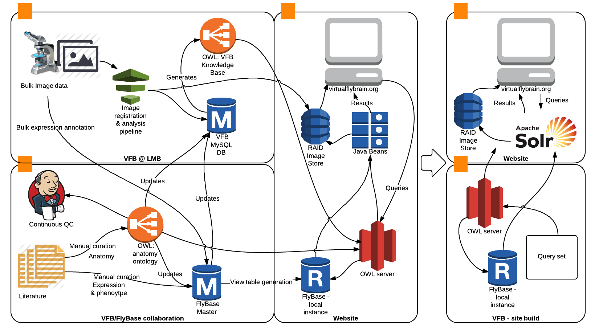

Main-Server:

Bocian-Backup:

master:

Dev-Server:

Sandbox-Server:

Sandbox1-Server:

Sandbox2-Server:

Sandbox3-Server:

Available Tickets:

# About Virtual Fly Brain

Virtual Fly Brain (VFB) is the only resource that integrates knowledge and images from across the field of _Drosophila_ neurobiology. Our content is curated from the literature and from multiple bulk datasets:  we have anatomical content from 100s of papers and expression & phenotype content from 1000s of papers; bulk image and expression data sets include data from flycircuit, Janelia Farm, Braintrap and the Labs of Kei Ito & Tzumin Lee.  We believe it is essential for users to be able to trace assertions and data on our site back to thier origins in the literature and bulk data sets, and so are fanatical about retaining and displaying provenance for all our content.

Our underlying datamodel uses an OWL ontology of Drosophila anatomy featuring extensively referenced descriptions of hundreds of neuroanatomical structures and thousands of neuron classes.  It also features an extensive collection of synonyms, which id used to drive our autocomplete-based text searches. An innovative logical component of this ontology drives [all queries on the site](https://github.com/VirtualFlyBrain/VFB/wiki/Queries). Queries for expression and phenotype have a second leg that directly queries FlyBase, to which all results are linked.  Queries for images also make use of an OWL knowledge base that codifies the results of image analysis.

VFB also features an image stack browser displaying images of the adult brain, with segmentation following the [BrainName standard](http://dx.doi.org/10.1016/j.neuron.2013.12.017), and the abdominal thoracic ganglion (in prep).  Individual neuropil domains are painted and linked directly to terms in the anatomy ontology. Thousands of images registered to our standard stack are linked directly to our ontology and can be viewed directly in the stack browser.

We also provide extra analysis of single neuron image data via clustering of morphologically similar neurons using neuron blast software developed by Greg Jefferis & colleagues (manuscript in prep).  Clustering finds many known classes as well as predicting new ones. [Clusters can be viewed as rotatable 3D images](http://flybrain.mrc-lmb.cam.ac.uk/vfb/fc/clusterv/3/Cha-F-300056/webgl.shtml). 

## Simple guide to editing this Repo

See the [Code Editing Guide](https://github.com/VirtualFlyBrain/VFB/wiki/Code-Editing-Guide) wiki.

Current issues that need work:

## Call for contributions

VFB is an open source project, increasingly embedded in the community it serves.  We believe that VFB can only achieve its full potential - as a site integrated with and responsive to the community it serves - by tapping the expertise of its increasingly technically savvy user community.  

We welcome all offers of contribution -

* Are you a biologist who would like to improve or extend the existing biological content of the site?
* Are you a VFB user willing to contribute critiques, user stories and feature requests?
* Do you have good communications skills that you could use to report news about VFB or to make video tutorials?
* Do you have an eye for design and think you could improve the look and feel of the site?
* Do you have skills in image analysis or display that you could contribute?
* Are you a coder with experience in javascript, python, java or JVM languages such as groovy or scala?
* Do you have an interest in semantics and experience with OWL?

If you'd like to contribute please email our google group at vfb_community {at} googlegroups.com with details of your brackground and how you might be able to help out.

### Social media presence

* We are [@virtualflybrain](https://twitter.com/virtualflybrain) on twitter.  Our feed features papers and news of general interest to the Fly Neuro community, as well as specific news about VFB.
* Our blog lives [here](http://vfbblog.inf.ed.ac.uk/)
* We also have a page on [FaceBook](https://www.facebook.com/pages/Virtual-Fly-Brain/131151036987118)

### Publications

 1. _Osumi-Sutherland D., Reeve S., Mungall C., Ruttenberg A. Neuhaus F, Jefferis G.S.X.E, Armstrong J.D._ (2012) A strategy for building neuro-anatomy ontologies. [Bioinformatics __28__(9): 1262-1269.](http://bioinformatics.oxfordjournals.org/content/28/9/1262.full)
 1. _Milyaev N., Osumi-Sutherland D., Reeve S., Burton N., Baldock R.A., Armstrong J.D._ (2012) The Virtual Fly Brain Browser and Query Interface. [Bioinformatics __28__(3): 411-415](http://bioinformatics.oxfordjournals.org/content/28/3/411.full)
 1. _Costa M., Reeve S., Grumbling G., Osumi-Sutherland D.,_ (2013) The Drosophila anatomy ontology. [Journal of Biomedical Semantics __4__:32](http://www.jbiomedsem.com/content/4/1/32)

### Annotating your own data using our system

We maintain a page on [the Drosophila anatomy ontology wiki](https://sourceforge.net/p/fbbtdv/wiki/Annotate_your_data/) outlining the advantages of annotating your own data using our system and providing links to resources for doing so.

### Documentation
Please note.  This is a work in progress. Most documentation currently lives in a google doc. We are in the process of transferring it to this wiki.

#### Overall architecture of project

Left panel shows the current architecture. Right panel shows planned development.

 * __[A brief intro to OWL, tailored for VFB](https://github.com/VirtualFlyBrain/VFB/wiki/Ont)__
 
 * __[Overview of queries](https://github.com/VirtualFlyBrain/VFB/wiki/Queries)__

 * __Functional Description__
     * [User scenarios](https://github.com/VirtualFlyBrain/VFB/wiki/user_scenarios)
     * [Description and functions of pages](https://github.com/VirtualFlyBrain/VFB/wiki/page_descriptions)
 * __Data structures__
     * [FlyBase CHADO](https://github.com/VirtualFlyBrain/VFB/wiki/FBChado)
     * [VFB link path DB](https://github.com/VirtualFlyBrain/VFB/wiki/VFB_DB)
     * [Ontologies](https://github.com/VirtualFlyBrain/VFB/wiki/ont)
     * [VFB OWL KnowledgeBase - individuals files and the code that generates them](https://github.com/VirtualFlyBrain/VFB_owl) (separate GitHub repo)
 * __Technical Description__
     * [Static content](https://github.com/VirtualFlyBrain/VFB/wiki/static_content)
     * [Dynamic content](https://github.com/VirtualFlyBrain/VFB/wiki/dynamic_content)
     * [Java](https://github.com/VirtualFlyBrain/VFB/wiki/java)
 
 * [__Stack Browser__](https://github.com/VirtualFlyBrain/VFB/wiki/stack_browser)
